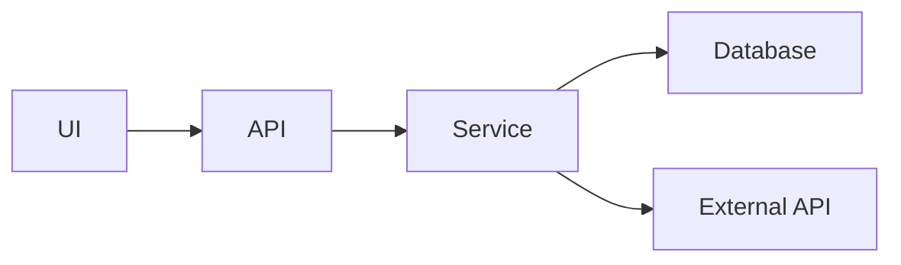

# Feature Integration Skill

> Comprehensive feature planning across multiple systems.

## When Activated

User mentions: "plan feature", "what files need to change", "integration points", "cross-system", "impact analysis", "scope this feature", "full breadth"

## Analysis Framework

### 1. Entry Points

Where does the user/system initiate this feature?

```markdown
## Entry Points
- [ ] UI Component: `src/components/...`
- [ ] API Endpoint: `src/api/...`
- [ ] CLI Command: `src/cli/...`
- [ ] Background Job: `src/jobs/...`
- [ ] Event Handler: `src/events/...`
```

### 2. Data Flow

What data structures are touched, transformed, persisted?

```markdown
## Data Flow
1. Input → Validation → Transformation
2. Business Logic → State Changes
3. Persistence → Database/Cache
4. Output → Response/Events

### Affected Data Structures
| Entity | Create | Read | Update | Delete |
|--------|--------|------|--------|--------|
| User | | x | x | |
| Order | x | x | | |
```

### 3. System Boundaries

Which services/modules are crossed?

```markdown
## System Boundaries
| System | Impact | Integration Point |
|--------|--------|------------------|
| Auth Service | Read | JWT validation |
| Payment Service | Write | Charge creation |
| Email Service | Write | Notification trigger |
| Analytics | Write | Event tracking |
```

### 4. State Changes

What state transitions occur?

```markdown
## State Transitions
| Entity | From State | To State | Trigger |
|--------|------------|----------|---------|
| Order | pending | confirmed | payment_success |
| User | active | verified | email_confirm |
```

### 5. Side Effects

What else gets triggered?

- Events emitted
- Notifications sent
- Logs written
- Metrics recorded
- Cache invalidations
- Webhook calls

### 6. Rollback Scenarios

What happens if this fails mid-way?

```markdown
## Failure Modes
| Step | Failure | Recovery | Data State |
|------|---------|----------|------------|
| Payment | Timeout | Retry 3x | Pending |
| Database | Constraint | Return error | Unchanged |
| Email | Failure | Queue retry | Logged |
```

## Output Format

```markdown
# Feature Integration Plan: <Feature Name>

## Summary
<1-2 sentence description>

## System Dependency Map


## File Change Manifest

### Create (New Files)
| Path | Purpose | Complexity |
|------|---------|------------|
| src/api/feature.ts | API endpoint | Medium |
| src/services/feature.ts | Business logic | High |

### Modify (Existing Files)
| Path | Changes | Risk |
|------|---------|------|
| src/routes.ts | Add route | Low |
| src/types/index.ts | Add types | Low |

### Tests Required
| Path | Type | Coverage |
|------|------|----------|
| __tests__/feature.test.ts | Unit | Core logic |
| __tests__/feature.e2e.ts | E2E | Full flow |

## Integration Test Requirements
- [ ] End-to-end flow works
- [ ] Error handling at boundaries
- [ ] Rollback scenarios tested
- [ ] Performance under load

## Risk Assessment

| Change | Risk | Mitigation |
|--------|------|------------|
| Database schema | Medium | Migration tested on copy |
| External API | High | Circuit breaker, timeout |
| Auth changes | High | Feature flag |

## Implementation Order

1. Database migrations (backward compatible)
2. Service layer (with tests)
3. API endpoints (with tests)
4. UI components
5. Feature flag removal

## Estimated Scope
- Files affected: X
- New files: Y
- Test files: Z
- Total changes: ~N lines
```

## Parallel Analysis

Launch parallel searches for comprehensive analysis:

```
Task(model=haiku, prompt="Find all files importing <related module>")
Task(model=haiku, prompt="Find all API endpoints in <related area>")
Task(model=haiku, prompt="Find all database queries for <related entity>")
Task(model=haiku, prompt="Find all tests for <related feature>")
```

## Used By

### Commands
- `/architect` - Primary planning skill
- `/implement` - Stage 2 planning
- `/analyze` - Understanding system connections
- `/refactor` - Cross-system impact
- `/migrate` - Migration impact assessment
- `/initialize` - Initial architecture understanding

### Agents
- **analyzer** - Uses for deep impact analysis

## Integration

- Primary skill for `/architect` command
- Triggers before large implementations
- Updates `active_context.md` with plan
- Used with opus model for complexity
